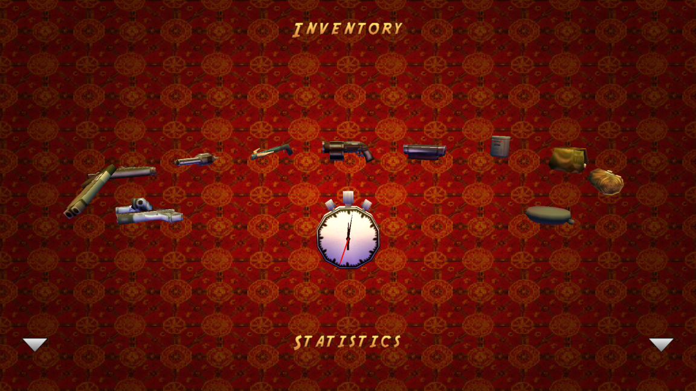

# Tomb Raider-Inspired Inventory with CRT Effect

This project features a **PS1-style inventory system** inspired by the original *Tomb Raider* (1996, PSX), combined with a **CRT post-processing effect** to evoke the visuals of classic consoles. This project was created as part of the Computer Graphics module hold by Timo Eberl (https://github.com/timo-eberl) at HdM (Stuttgart Media University).

> 

---

## How It Works

- Items are arranged in a **circular carousel**, each facing outward.
- Navigate between items using the **A** and **D** keys on the keyboard.
- The **selected item rotates continuously** around its Y-axis.
- Press **Q** to enter **Inspect Mode**:
  - In this mode, the camera orbits the item using **W / A / S / D**.
  - Press **Q** again to return to the carousel.
- The **CRT filter** can be toggled at any time using the **checkbox near the title**.

---

## Usage with Visual Studio Code

1. Open the folder `Deliverables` with VSCode (`File` > `Open Folder...`).
2. Install the Extension [Live Server](https://marketplace.visualstudio.com/items?itemName=ritwickdey.LiveServer). With this extension you can launch a local static file server.
3. Right-click `index.html` of the exercise you want to work on and click `Open with Live Server`.
4. The website opens in your default browser. Everytime you save a file in VSCode, the browser tab gets refreshed.

---

## Why did i choose it?

As someone with a passion for retro gaming, especially from the **PSX and PS2 era**, I wanted to recreate the *Tomb Raider* inventory. Its inventory system stuck with me over the years. I also added an **Inspect Mode** inspired by *Resident Evil* to let players closely examine items.

I'm also fascinated by **authentic graphics on original hardware**, which is why I included a **CRT effect** as a nod to the era.

---

## Reference

> Inventory inspired by *Tomb Raider* (PlayStation, 1996)
>
> 
---

## Controls

| Key        | Action                                |
|------------|----------------------------------------|
| **A / D**  | Cycle through items in the carousel    |
| **Q**      | Enter/exit Inspect Mode                |
| **W/A/S/D**| Rotate camera in Inspect Mode          |
| ⬜ Checkbox| Toggle CRT post-processing filter       |

---

## External sources

### 3D-Models with Textures
- PSX Cardboard Box by **zhya**: https://sketchfab.com/3d-models/psx-cardboard-box-e4881315912d4ef69282c460def5b872 
- PSX Stockpot by **Charckes**: https://sketchfab.com/3d-models/psx-stockpot-5df3dba1a5634e558040e37483ff509e 
- PSX 357 Magnum Revolver by **Charckes**: https://sketchfab.com/3d-models/psx-357-magnum-revolver-7f8b565bee8249fd9bf4d226cf9ed0de by Chrackles
- PSX Bloody Fire Axe by **Charckes**: https://sketchfab.com/3d-models/psx-bloody-fire-axe-d17f0ddd6d354906b861d648834c6024
- Silent Hill 1 Meshes - Video Tape by **SilentQuest**: https://sketchfab.com/3d-models/silent-hill-1-meshes-video-tape-1cb097f5d75848bb88a6a776a4a943ee
- Silent Hill 1 Meshes - Handgun Bullets by **SilentQuest**: https://sketchfab.com/3d-models/silent-hill-1-meshes-handgun-bullets-2f6cbf1310184d908d9ada49dc0f99b3
- Silent Hill 1 Meshes – Chemical by **SilentQuest**: https://sketchfab.com/3d-models/silent-hill-1-meshes-chemical-748bdc335d4b4eb19fcd3423c62c51db
- Silent Hill 1 Meshes - Silver Medallion by **SilentQuest**: https://sketchfab.com/3d-models/silent-hill-1-meshes-silver-medallion-b5661678ab0243999bc9833101613720

### Single textures
- leather_red_03_coll1_1k by **Rob Tuytel**: https://polyhaven.com/a/leather_red_03
- wooden_gate_diff_1k by **Amal Kumar**: https://polyhaven.com/a/wooden_gate